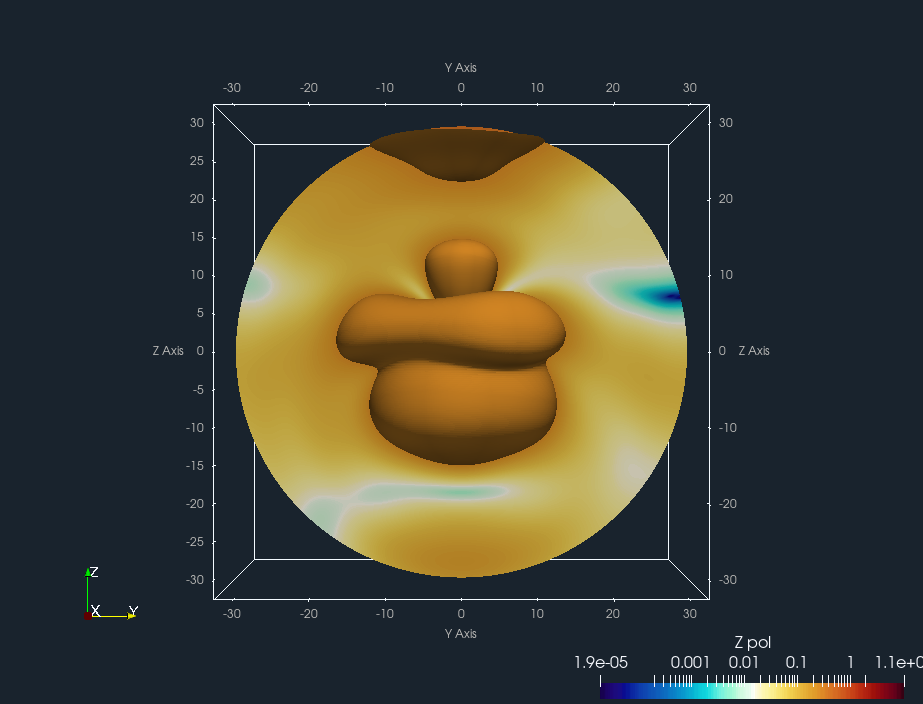

UKRmol+ ParaView plugins
========================

Jakub Benda (c) 2023

[ParaView](https://www.paraview.org/) plugins with readers for various [UKRmol+](https://www.sciencedirect.com/science/article/pii/S0010465519303972) output files.

Tested with ParaView 5.11.2.

### DipelmReader

Visualization of the 3D photoelectron angular distribution.

